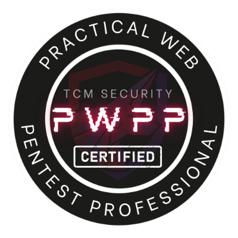
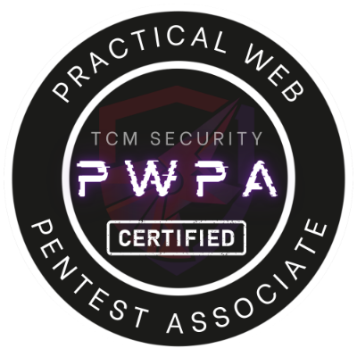
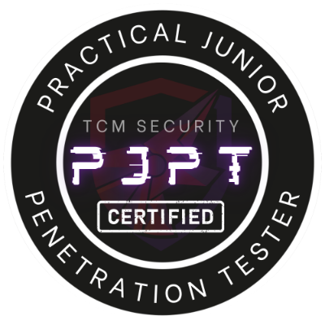
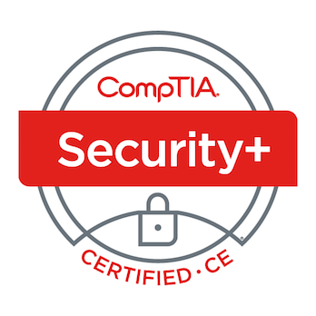

# whoami && echo 'Hello, World!'

## Web Application Security Knowledge Base

### Introduction

Hello, and welcome! My name is **John Cruz**, and this GitBook serves as my **Web Application Security Knowledge Base**. Here, I share my experience, research, and insights into web application penetration testing, vulnerability assessment, and security best practices. Whether you're a hiring manager, recruiter, security professional, or simply curious, this resource provides a clear view of my practical experience and skills.

### Why This GitBook?

This GitBook is a practical documentation of my journey and ongoing experience in web security. It showcases:

* Technical breakdowns of web vulnerabilities like SQL Injection, NoSQL Injection, Race Conditions, and Server-Side Request Forgery (SSRF).
* Hands-on exploitation techniques demonstrated through real-world case studies, PortSwigger Labs, Hack The Box scenarios, and independent research projects.
* My methodology for web penetration testing, shaped by professional training, relevant security certifications, and a solid foundation in full-stack web development.

***

### Certifications & Professional Training

To further enhance my skills, I've obtained several penetration testing certifications focused on real-world scenarios:

#### 1. [Practical Web Pentest Professional (PWPP)](https://academy.tcm-sec.com/p/practical-web-penetration-testing)

<figure><figcaption></figcaption></figure>

The PWPP certification validates my ability to perform comprehensive web application penetration tests, focusing on advanced vulnerabilities such as NoSQL Injection, SSRF, Race Conditions, Mass Assignment, and Template Injection. Unlike traditional capture-the-flag (CTF) certifications, the PWPP emphasizes realistic scenarios, report writing, and practical methodologies.

#### 2. [Practical Web Pentest Associate (PWPA)](https://academy.tcm-sec.com/p/practical-web-penetration-testing)

<figure><figcaption></figcaption></figure>

The PWPA certification demonstrates my foundational expertise in identifying and exploiting common web vulnerabilities, including SQL Injection, Cross-Site Scripting (XSS), and File Inclusion. Like the PWPP, it emphasizes practical, scenario-based testing and professional reporting.

#### 3. [Practical Junior Penetration Tester (PJPT)](https://academy.tcm-sec.com/p/practical-ethical-hacking)

<figure><figcaption></figcaption></figure>

The PJPT certification assesses internal network and Active Directory penetration testing skills. It covers enumeration, misconfiguration identification, privilege escalation, and domain compromise, complementing my web application security knowledge.

#### 4. [CompTIA Security+ (Sec+ 701)](https://www.credly.com/badges/7d06c8d7-ce80-4094-b87d-4ddced0d0bce/public_url)

<figure><figcaption></figcaption></figure>

The CompTIA Security+ certification provided me with foundational cybersecurity knowledge, including risk management, security architecture, incident response, and network security fundamentals. This broad understanding enhances my capabilities in securing applications comprehensively.

***

### My Experience & Approach

With a strong background in full-stack web development and dedicated training in offensive security, my approach includes:

* Performing structured penetration tests and assessments on internal web applications.
* Identifying complex vulnerabilities beyond basic injection attacks, including business logic flaws, deserialization vulnerabilities, and race conditions.
* Understanding security from both offensive and defensive perspectives, providing actionable recommendations that developers can implement effectively.

***

### What You'll Find in This Knowledge Base

This GitBook serves as a structured collection of my research and hands-on experience in web application security. It includes:

* **Research on Web Application Vulnerabilities** – In-depth analysis of security flaws, exploitation techniques, and remediation strategies.
* **PortSwigger Web Security Academy Walkthroughs** – Step-by-step solutions to labs covering OWASP Top 10 vulnerabilities, business logic flaws, and advanced exploitation techniques.
* **Hack The Box Walkthroughs (Web-Focused)** – Detailed breakdowns of web application challenges, demonstrating real-world penetration testing methodologies.

### My Goal

I am looking to join a security-driven team where I can apply my skills in web application security, penetration testing, and vulnerability assessment. My goal is to help organizations identify, understand, and remediate security flaws, ensuring their applications remain resilient against modern threats.

***

### Connect with Me

* **Portfolio**: [johncruz.info](https://www.johncruz.info/)
* **GitHub**: [github.com/jocruz](https://github.com/jocruz)
* **LinkedIn**: [linkedin.com/in/jocruz94](https://www.linkedin.com/in/jocruz94/)

I invite you to explore my work, review my certifications, and reach out to discuss how I can contribute to your team.

Thank you for visiting!

— JC
